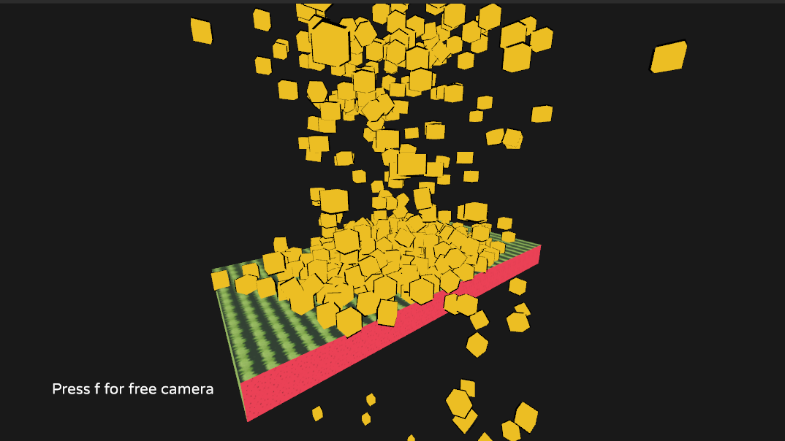

# Dynamic Physics Objects in LÖVR

This LÖVR project demonstrates dynamic collider management, featuring a size-changing collider and a system for spawning/destroying boxes. Boxes spawn randomly, fall, and are cleaned up when below a Y-axis threshold. The dynamic collider resizes over time using sine/cosine functions. Customize spawn rates, areas, and collider behavior via `spawn_interval`, `boxes_spawn_size`, and sine/cosine adjustments.  

